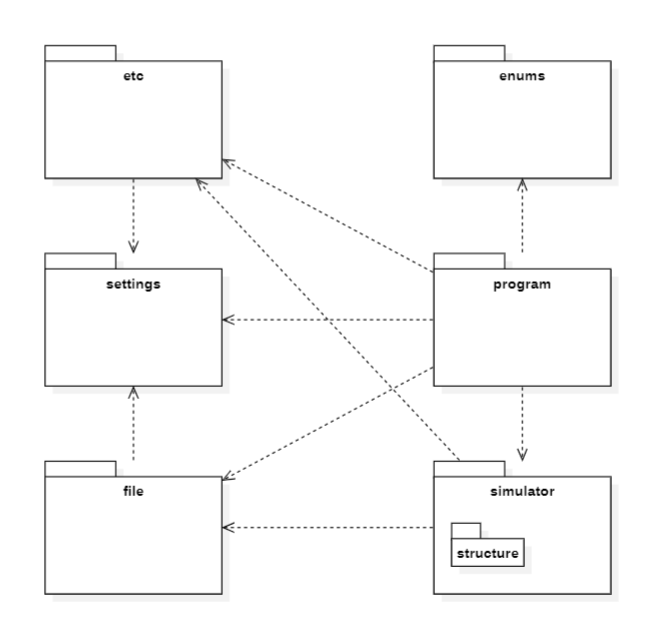
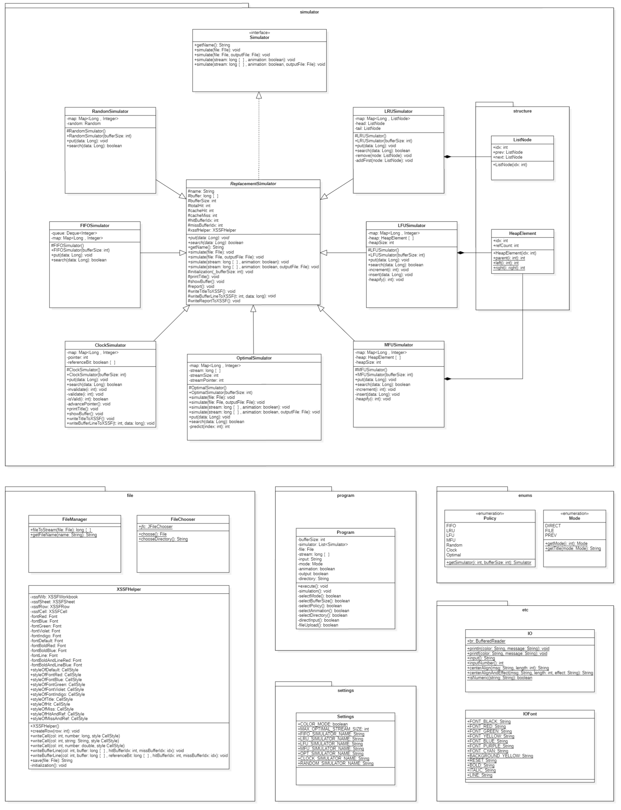
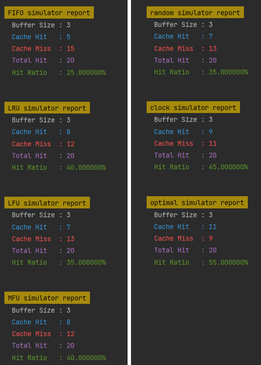

# Pace Replacement Simulator

-   OS
-   Java 11

 

## DOC

-   [PDF](docs/doc.pdf)

 

## LIBRARY

-   poi-bin-5.2.3
    -   https://www.apache.org/dyn/closer.lua/poi/release/bin/poi-bin-5.2.3-20220909.zip
-   log4j-core-2.19.0
    -   https://www.apache.org/dyn/closer.lua/logging/log4j/2.19.0/apache-log4j-2.19.0-bin.zip

 

## PACKAGES

 

## CLASS

 

## DESIGN PATTERN

-   Template Method
-   Strategy

 

## PRODUCT

-   입력 예시

    

-   결과 출력

    

-   애니메이션 출력(예시: optimal simulator)

    

-   엑셀 저장(예시: clock simulator)

    
